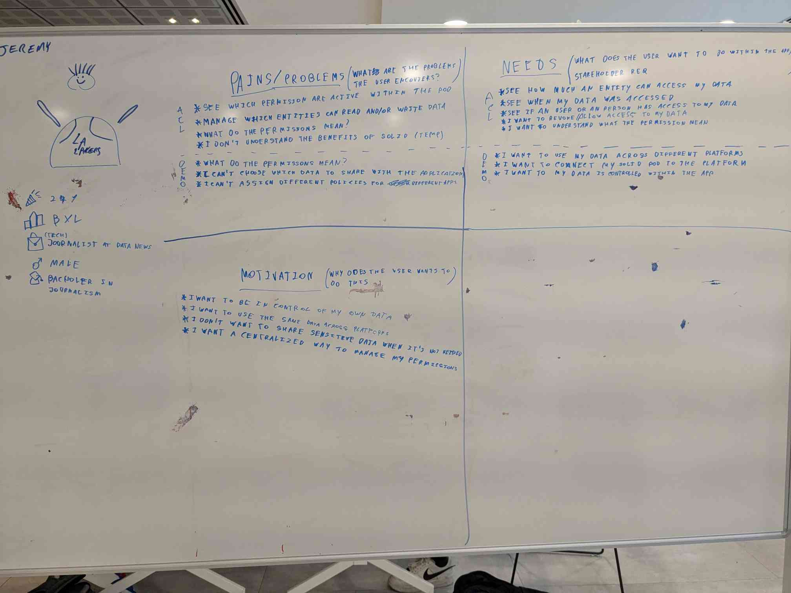
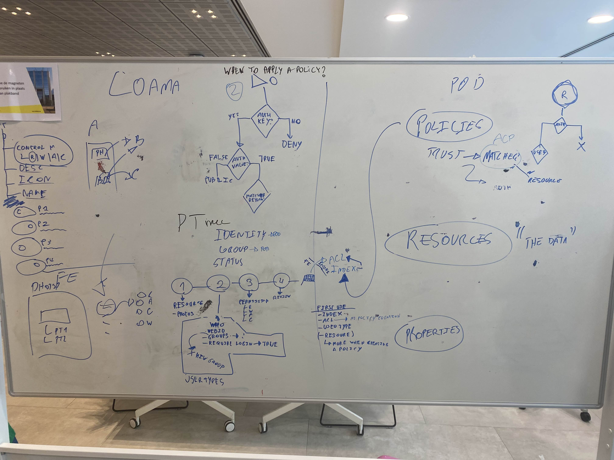
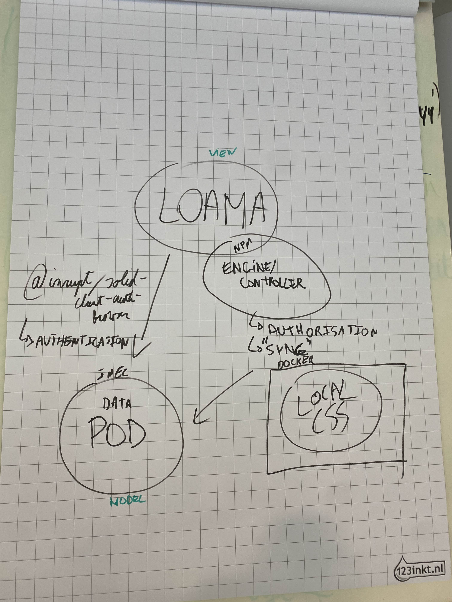
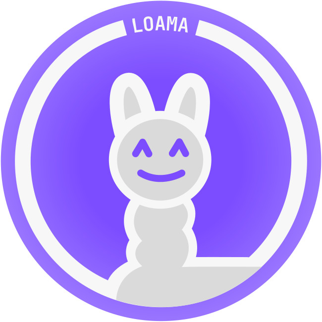
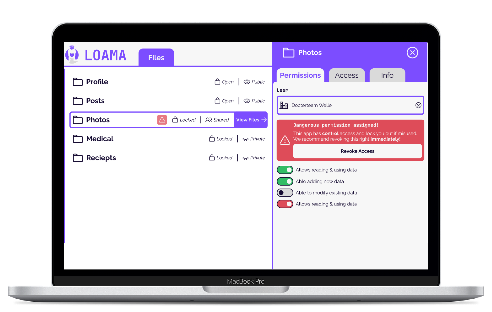
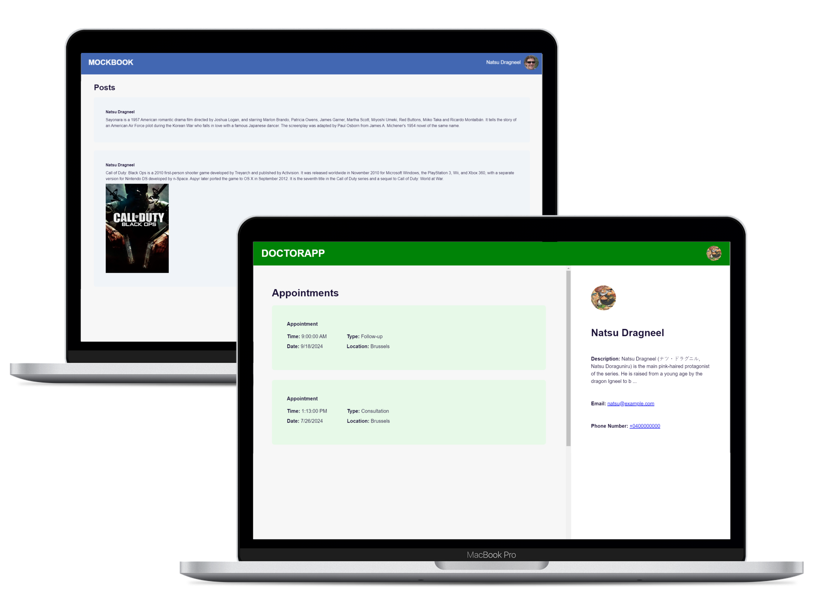
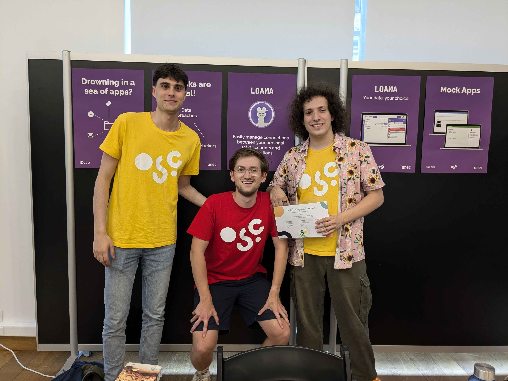
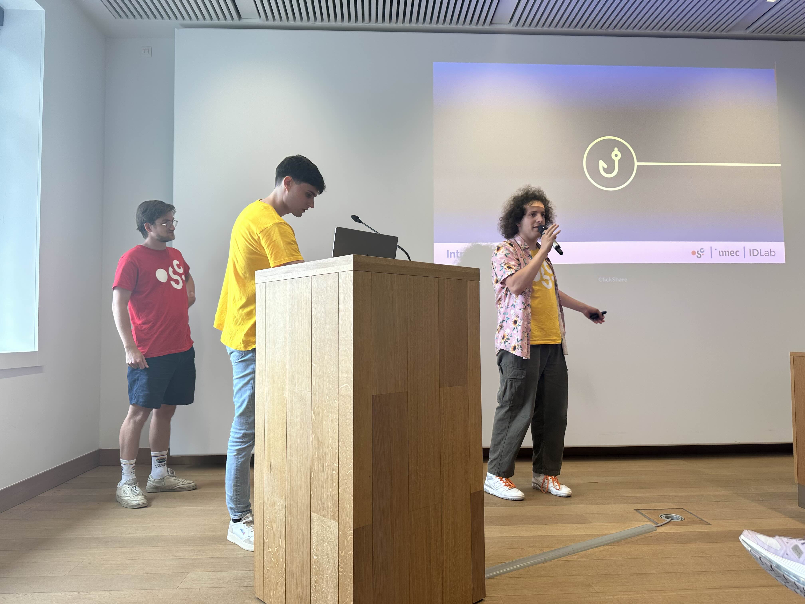
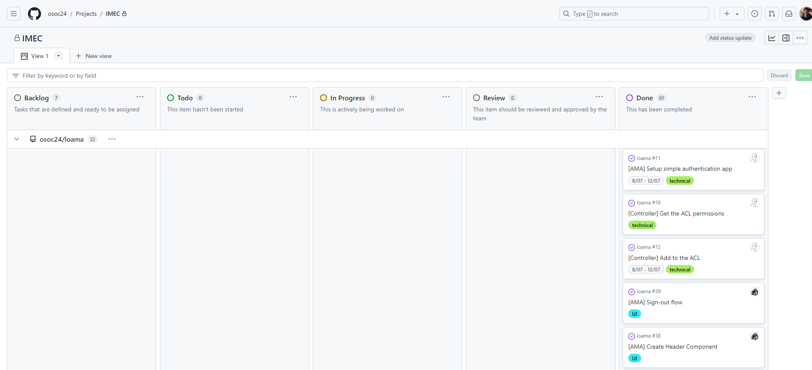

As you may have read in one of my previous post about the goals of 2024, I wanted to participate in
[Open Summer of Code](https://osoc.be/). And guess what? I got selected and just finished the full 4 weeks of the program.

In this post I want to share the experience, learnings and the project I worked on. It will not be technical but more about the experience (teamwork, project management, etc.) and the program itself.

---

We're already past the half of the year. It goes so fast! I've been working on a lot of things and I'm excited to share some of them with you. One of the things I'm most excited about is that I got selected for the Open Summer of Code program. It's a 4-week-long program where students work on open source projects. It's something I've been wanting to do for a while, and I'm glad I had the opportunity to do it this year.

I will share the process from kicking off the first day up until the demo day, where we presented our project. It's important to note that I talk about weeks in this post. The program was 4 weeks, but there were only 4 days of work (Monday to Thursday) in each week. At least one day was remote, and the other days were at the office in Brussels.

## Kickoff

The first day was the kickoff day and a very exciting one. I stayed at my dorm room in Bruges during the month because it was easier to take the 1 hour and 10 minute train to Brussels. The program was held at one of its sponsors' offices, namely the Flemish government. The building was really nice and modern. We were welcomed by the team and the coaches.

Everyone was happy to meet each other and be able to participate but also a bit nervous. We didn't know the project topics yet, and we were all curious to know what we would be working on for the next 4 weeks.

Once the mentors introduced themselves, the program, and the projects we dived into a Google document that we received from the client. At first, the topic of the project was unclear to me, and I had never heard of it. Luckily, I got some help from the mentors and the other students. It all became clearer during the brainstorm sessions that we had during the week, where we exchanged some ideas from the research we did.

We almost always used post-its to write down our ideas and stick them on the wall. This way, we could see all the ideas and group them together. I eventually came up with the name LOAMA. It was a combination of the words "Linked Open Access Management App". Now we had to make a logo for it. Because LOAMA makes you think of the animal llama, we decided to use it in our logo. It was a fun mascot to work with and grabbed your attention right away.

The other brainstom sessions that we had during this week were about the user persona, user flow and project architecture. We had to think about who would use the app and how they would use it. Below are some pictures:

<figure style="text-align: center;">
    
    <figcaption>User persona</figcaption>
</figure>

<figure style="text-align: center;">
    
    <figcaption>User flow</figcaption>
</figure>

<figure style="text-align: center;">
    
    <figcaption>Architecture</figcaption>
</figure>

For the rest of the week we continued to do some research to get a better understanding of the topic and to have all the necessary tools to start the design phase of the project.

## LOAMA

The project we were working on was for the client [imec](https://en.wikipedia.org/wiki/IMEC). The goal was to create an access management app where we try to make the concept of [solid](https://solidproject.org/) more accessible to the general public and show the potential of the technology. In the app, you connect to your personal online data storage and manage access to your data. For example, if Facebook wants to access your latest photo album, you can give them access to it. At any time, you can revoke the access. This allows you to have more control over your data and privacy, reducing the amount of personal data that is stored on the servers of big companies and reducing the risk of having your personal data in data breaches.

<figure style="text-align: center;">
    
    <figcaption>Loama logo</figcaption>
</figure>

## Design

We spent the full second week converting the brainstorm ideas from the last week into a design. We built both lo-fi and hi-fi prototypes in Figma for this. It allowed us to get a better understanding of the project and the client's needs. We also had a meeting with the client to show them the design and get feedback. We made a style guide and did some user testing using the [maze](https://maze.co/) tool. This allowed us to see how users interacted with the design and what we could improve to make the app more user-friendly.

The thing I learned the most during this week was that it's important to have a good design to get everyone on the same page. However, as we were a team of developers, some had different opinions on the design, which resulted in some discussions. It's important to have a good balance between design and functionality. I also think that designers can be too focused on the design, making it almost some kind of art piece. It's important to remember that the design is a tool to make the app more user-friendly and not the main goal.

## Core dev week

This week was all about coding. We defined the scope in the first week and already made issues in a GitHub Kanban. Now, it was just starting to convert those issues into pull requests. For our main access management app, we used Vue.js for the frontend. As backend, we made an extra folder called "controller." The reason for this is that we wanted to make the app as modular as possible. If the client wanted to extend it with more features, it would be easier to do so by making it a separate package. This code was fully written in TypeScript and used libraries such as inrupt solid, and solid-auth-client to interact with the solid storage (pod).

I focused more on the mock apps, which were Mockbook (referring to Facebook) and Doctorapp, which displayed your doctor appointments. These were two demo apps that get data from the pod and show it in the app. This way, it was easy to visualize the effect of the access management app. If you don't give access to the Mockbook app, it won't show any data.

<figure style="text-align: center;">
    
    <figcaption>Loama app</figcaption>
</figure>

<figure style="text-align: center;">
    
    <figcaption>Mock apps</figcaption>
</figure>

I personally learned a lot during this week. As a student graduated in AI, Python is my main language. I've never worked with Vue.js before and only had some experience with TypeScript. It was a challenge to get up to speed with the tech stack, but I learned a lot from it. It was the first time someone else reviewed my code, and I had to review someone else's code in this coding language. It might not have been the best code and sometimes took a while to figure it out, but it was a good way to take it to a higher level.

## Final week

The final week was all about finishing the project. On Thursday, the demo day, we had to present the project to the client, other teams and visitors that signed up for the event (+/- 40 people). We had to make sure that everything was working and that we had a good pitch. During the afternoon, there was a booth where people could come and ask questions about the project.

As we struggled a bit on the last day of the previous week, we spent the entire Monday coding. We were planning on giving a live demo at the booth, so everything had to work well. Another important task this week was making the documentation. We used [vitepress](https://vitepress.dev/) for this, going over our thoughts and decisions made during the project. This includes the current scope and some features we didn't implement, how to set up the project, how to run it, how to deploy it, etc.

<figure style="text-align: center;">
    
    <figcaption>Team</figcaption>
</figure>

The demo day was a success. We had a good pitch, and the live demo went well. The client was happy with the result, and we got some good feedback from the other teams. It was a great experience to work on this project, and I'm happy with the result that we delivered.

Thanks to this team of great people (from left to right): me, Friedrich, and Bo, we were able to deliver this project and had a great time during the 16 days of the program.

<figure style="text-align: center;">
    
    <figcaption>Demo day pitch</figcaption>
</figure>

## Lessons Learned

### Communication

**Open Communication**

One of the most significant lessons we've learned is the importance of maintaining open communication within the team. Being open to new ideas and encouraging everyone to share their thoughts (even crazy ones) has been crucial to making sure that we're all on the same page and working towards the same goal.

We've used a Discord channel for quick questions, discussions and asking for code reviews to ensure that each team member gets immediate feedback and can continue their work without unnecessary delays.

To keep everyone on the same page, we've done a daily morning meeting. This meeting is a time to discuss progress, address any blockers, and plan the day's work. It sets a positive and productive tone for the rest of the day.

Sometimes you get into discussions about the project. It's important to keep in mind that everyone has their own opinion and that it's important to listen to each perspective. Especially if there is no real decision maker in the team, it's important to come to a consensus. This is something that I learned during the program, and I think it's a valuable lesson that I will take with me in the future.

**Coaching**

We held a weekly retrospective to reflect on what went well, what could be improved, and to celebrate our successes. Each person had 10 minutes to write post-its and put them in the corresponding column. Then we discussed the post-its and made action points for the next week.

In addition to retrospectives, we conducted weekly one-on-one meetings with our coach. These sessions provided a private space for team members to discuss their personal progress, challenges, and goals. It's a time for individual support and development, ensuring that everyone feels heard and valued.

To further enhance our learning, we had a weekly presentation on the last day of the week (Thursday). Here we presented what we've learned, what we've accomplished, and what we plan to do next to the whole osoc group. The first part consisted of our pitch, and the second part focused on the progress we made during the week. It was also a great opportunity to get critical feedback from the other teams and mentors. My team consisted of 3 people, so each one of us had to present once. For our pitch on demo day, we decided to do it together.

### Project Management

This is the most important thing that I learned during the program. In contrast to school projects, we had a structured approach to project management. Every week was a new sprint. The first week was brainstorming, the second week was design, the third week was development, and the fourth week was testing and deployment. This systematic workflow ensured that we covered all aspects of the project thoroughly and delivered a high-quality result.

During the brainstorming phase, we created user personas and user flows to understand our target audience and their needs. We also used post-its and whiteboards to note down ideas and organize our thoughts visually.

We've adopted GitHub Kanban to manage our projects. This tool helps us keep track of issues and pull requests, making our workflow more organized and efficient. It also allows us to prioritize tasks and assign them to team members, ensuring that everyone knows what they need to do next. It was my first time working with this tool, and I really liked it. It was a great way to keep track of progress and what needs to be done next.

<figure style="text-align: center;">
    
    <figcaption>Project Kanban</figcaption>
</figure>

**You can find the repositories of the project here:**

- [LOAMA code](https://github.com/osoc24/loama)
- [Mock Apps code](https://github.com/osoc24/toco)
- [Documentation](https://osoc24.github.io/doco/)

## Conclusion

I think that the experience of Open Summer of Code is really great! Especially for students who are looking to get some experience working in tech.

Although I didn't have a lot of experience in the topic and tech stack we used, I learned a lot outside of coding. Going through the whole process of starting with an idea and ending with a minimal working prototype was invaluable. The result that we delivered was beyond the expectations of the group, and the client imec was also really happy with how it turned out.

Now we've already passed 2 of the 3 main goals of 2024. Next up: get a job.
