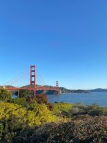
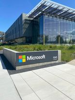
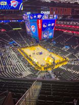
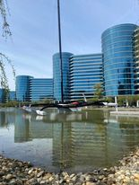
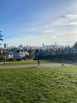
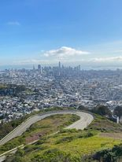
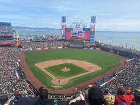

From April 3rd to 10th, I had the opportunity to travel to San Francisco with my college, Howest University for Applied Sciences. Our group consisted of 60 people, including 30 studying Devine, 15 studying MCT in Kortrijk, and 15 from Applied Computer Science in Bruges, which is the program I am a part of. This trip was primarily organized for seniors, but I was lucky enough to be the only second-year student allowed to come along.

The purpose of the trip was to explore American culture, innovation, and visit big tech companies in the Bay Area. In this blog post, I'll only write about the most important parts of the trip, as things like "what did you eat for breakfast" aren't really noteworthy and mostly the same.

---

## April 4th (Big Tech Visits & NBA)
Tuesday 4th was the first and most busiest day. 

Tuesday, April 4th, was the first and busiest day of our trip. Our plan was to leave the hostel at 7:30 AM to go to the Golden Gate Bridge. Unfortunately, everyone was already awake due to the jetlag from our 11-hour flight. Once we arrived, we walked the full 1.7 miles or 2.7 kilometers and enjoyed the beautiful view. I even helped some Chinese tourists take a picture before we went on a private bus ride to the Bay Area.

Our first stop was **Palo Alto Networks**, where we were welcomed by a lovely lady named Bree, who works there as a recruiter. She gave a presentation where she explained what the company does and what the company values. After that, she invited three new-grad tech employees to answer questions about their first job, how they got the job, etc. We later got a guided tour around the office.

By the time we were done with the tour, it was almost noon, so we stopped at In-n-Out for lunch. It was my first experience, and it was really nice, but I didn't like the fries as much (maybe because I'm used to the French fries in Europe).

Our second company visit was to **Microsoft**, which was something I was looking forward to.
We were expected by Nills, a Belgian working for Microsoft in the Bay Area. He told us about his experience moving to the US and gave some tips and tricks about getting a job in the US. At the end, he talked a bit about the latest developments, e.g., GitHub Copilot and Microsoft's low code platform, as AI is a hot topic at the moment.

At 3 PM, we went to our last stop before going back downtown, which was the **Apple Visitor Centre**. To be honest, this was quite a disappointment. We had a great small tour, but it wasn't anything special. There was a store on the ground level, a terrace on top, and some info about the big Apple Park. The office is very secured and not open to the public. The surroundings are really beautiful, and it evoked the exact feeling I have when I think about the company. I've always admired the innovation and simplicity of Apple.

In the evening we planned on going to the **NBA game**. It was amazing but expensive, but I thinks thats for all sports in the US. The warriors played against oklahoma and I saw some famous players like Stephen Curry and Draymond Green. What I noticed is that there is al lot more organized around the game.There's animation long before the game starts, like the players intro, fireworks and light shows. During breaks, there's always something to watch. I wonder why this isn't in Europe because I think a lot more people would come to sport events just for the experience.

<table><tr>
    <td>  </td>
    <td>  </td>
    <td>  </td>
</tr></table>

&nbsp;

## April 5th (Alumni in SF & UC Berkeley)

On this Wednesday, we had the luxury of sleeping in a bit longer after a busy previous day. Our day began at 9 am at storied, a company that previously assisted Belgians in securing jobs in San Francisco. The founder and CEO provided us with an overview of the company, and then we were introduced to two alumni from our school who have been working in San Francisco for almost a decade. First, Christian (ex-Pinterest, now Cambly) gave a presentation, followed by Jens (ex-Stripe, now OpenAI). Both of them spoke about their work in the US and how and why they relocated to the Bay Area. Afterward, we enjoyed a meal and I had the opportunity to ask Christian some questions. This talk was one of the best I've had in a while, and it motivated me to pursue a career in the tech industry.

In the afternoon, we took BART, the local train, to Oakland. There, we visited UC Berkeley and received a guided tour from two French students who study there. I was blown away by how massive the campus was; it was unlike anything I had seen before in Belgium. The campus resembled an entire village, with numerous parks, over ten buildings, and a bustling population of students and staff.

At 6 pm, our day came to a close, and we had the evening free. I was accompanied by two friends, and we sought out a place to eat in the busy student neighborhood outside of campus. We chatted with some local students on the street and took the train back to downtown San Francisco.

&nbsp;

## April 6-8 (Thursday + Friday)

On Thursday, April 6th, we had a more touristic day. We left our hotel at 8am and took a bus to several famous stops because of their beautiful views. First, we went to the "painted ladies" and then to Twin Peaks, a spot on top of a hill that overlooks the entire city (see pictures). 

We didn't stay that long because we were also expected by Odoo around 10am. **Odoo** is one of Belgium's biggest tech companies and mainly focuses on ERP (Enterprise Resource Planning). We had a presentation and some aftertalks with the director of Odoo America. They offered us some lunch, which we greatly appreciated.

After lunch, we went to the next big tech company, **Oracle**. Once we arrived, we saw the big offices and a beautiful catamaran on the lake next to it. We were received by Scott, an operational manager at Oracle Academy. He let us into a fancy presentation room where we had some drinks and cookies. Later on, he explained how to use the online Oracle Academy and what it has to offer. The second speaker, Ashih, a VP of Product Management/Strategy, taught us about APEX, a low-code platform that makes it very easy to customize any project. Our last speaker, Samar, who works for Oracle Analytics Cloud, talked about their analytics cloud products and big data visualizations.

At 3pm, we left the Bay Area to go to Dolores Park, a park on the side of a hill with some views of the city. There we were dropped off and were free for the afternoon/evening.

Friday was a bit more of a calm visiting day. We started the morning with a walk to Salesforce Park, a park on top of a bus station. It wasn't so special, but I could imagine a lot of people could spend their day there outside of the office in the summer. Afterwards, we walked to the Ferry Building, a long hall full of different shops. From there, we walked to Oracle Park, the home stadium of the San Francisco Giants (baseball team). We weren't aware that there was a match, but we quickly found out that there was a 3-day game programmed because it was the opening of the new season.

In the afternoon, we had an appointment with CloudFlare. We got a guided tour by one of the employees and later on a presentation. I really liked the interior of the office and they had lovely employees. 

Once finished, we were free and had dinner at Uncle Vito's Pizzeria, which was very good!

<table><tr>
    <td>  </td>
    <td>  </td>
    <td>  </td>
</tr></table>

&nbsp;

## Alcatraz + Free time
On Saturday, we had our first full free day. I started the day with a run from the baseball stadium to Pier 39. On the way back to the hostel, I got lost, but I think it was fun and part of the experience. Some people asked, "why do you run on vacation?" Well, I don't think vacation is an excuse to skip your normal exercise routine. Running was a refreshing break after a few busy days and allowed me to explore new sights and neighborhoods.

At 11 am, we took the metro to the baseball stadium. We had bought the cheapest tickets and had a nice experience. The game lasted for 2 and a half hours, and I learned new things because baseball isn't a big sport in Europe.

After the game, we went back to the hostel to relax a bit. We closed the day with dinner in the Lower Nob Hill area. Some friends went out clubbing, but I couldn't go because I'm only 20, and in the US, you can only drink alcohol from 21. I once took a sip from a friend's american beer before in a restaurant and found it gross (maybe because I'm Belgian), so I wasn't really upset about it.

On Sunday, the 9th, we had our last full day in San Francisco. In the morning, we took the metro and went to the ferry that brought us to Alcatraz. We had an audio tour and hung around the island. It had a long history, but what struck me the most was the smell there. The island has a large number of seabirds like seagulls and pelicans.

Once we were back on the mainland, we walked to Pier 39, a touristic spot with a lot of animation and shops. We had lunch there, and I bought a cap as a remembrance of the trip.

We spent the whole afternoon exploring/walking in that area and had a sourdough bowl with soup as dinner, which is apparently a typical local food from San Francisco.

&nbsp;

##  Flights on the mondays
On Monday, the 3rd of our trip, we took our first flight. We flew with United Airlines and departed from Paris on an 11-hour journey, marking my longest flight to date. Fortunately, we were provided with good food, a helpful crew, and good movie options to pass the time. While the first 8 hours were relatively easy, the final 3 hours proved to be a bit of a struggle. However, I was fortunate enough to have pleasant neighbors during the flight, and was able to chat with them and get to know them better.

The return flight was pretty much the same, although I was able to get a couple of hours sleep.

## Thoughts about SF and the bay area
During my week in San Francisco and the Bay Area, I noticed some small but significant cultural differences.

**Cons:**

The biggest problem in San Francisco is its large population of homeless people. Although there are homeless people in Belgium, they are generally less active. During my stay, I saw homeless people start randomly shouting, coming close to me, being aggressive, and even sticking needles in their arms on random sidewalks. In Belgium, most homeless people simply lie on the ground, sleep, or sit and politely ask for money.

Another con is that everything in San Francisco and the Bay Area is expensive. As a tourist, you should consider this when planning your trip. While local people earn more, especially in tech, I believe that the percentage of income spent on living expenses is **almost** similar to that of Belgium.

**Pros:**

America is known for its fast food culture, where people eat a lot and not necessarily healthy. However, I appreciated that most drinks come with refills, while in Belgium, you pay for only one drink.

I also enjoyed the sunny weather in San Francisco and the Bay Area. Downtown and the Bay Area were very hot for April, and I even burned my nose. If you're looking for some refreshment, head to Pier 39, the marina, or Golden Gate Bridge Park where there's always a little bit more wind.

Lastly, I love the American people. I never thought that there was such a significant difference between Americans and Belgians in general. Americans are very open and optimistic. They like spontaneously speaking to new people and are very direct. I think that Belgians are perhaps a bit more conservative and think more about themselves.

&nbsp;

That's all for now. I hope you found this interesting and informative. If you have any questions or would like more information about shops, spots, etc., feel free to contact me!

